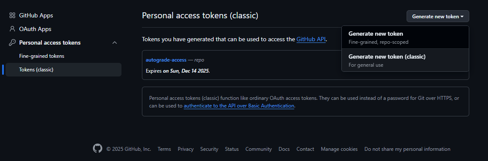
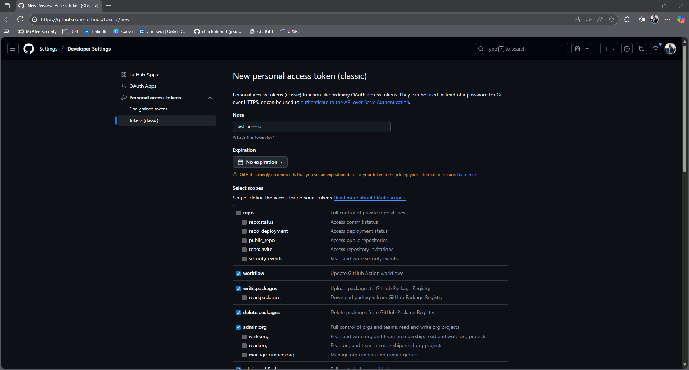
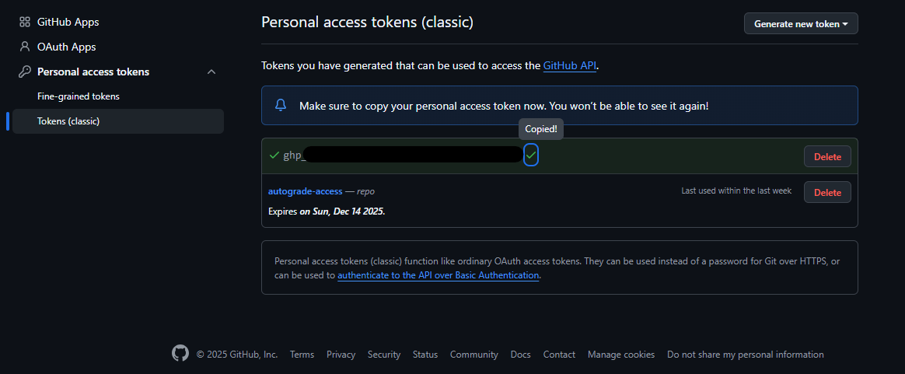
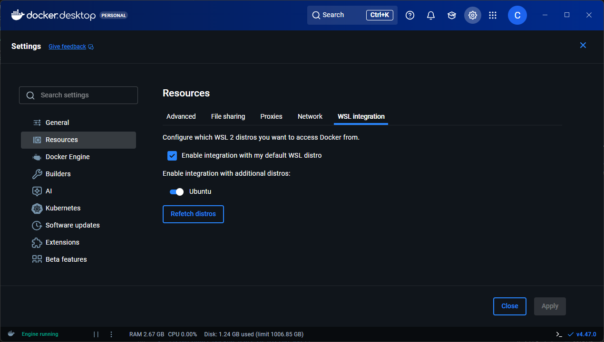
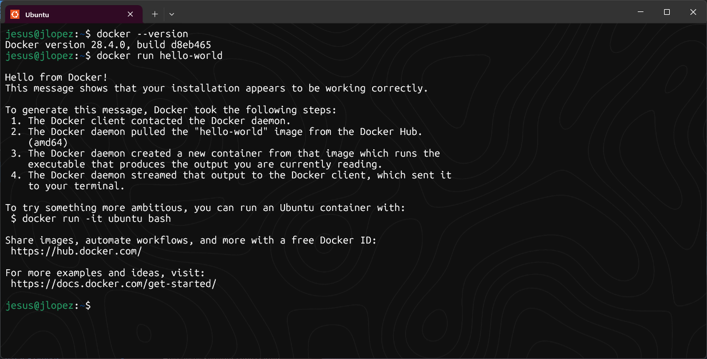
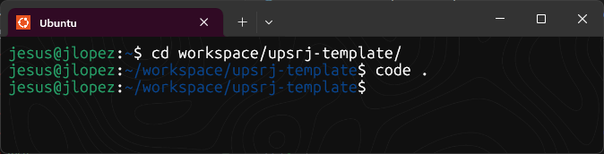
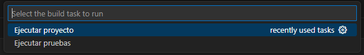
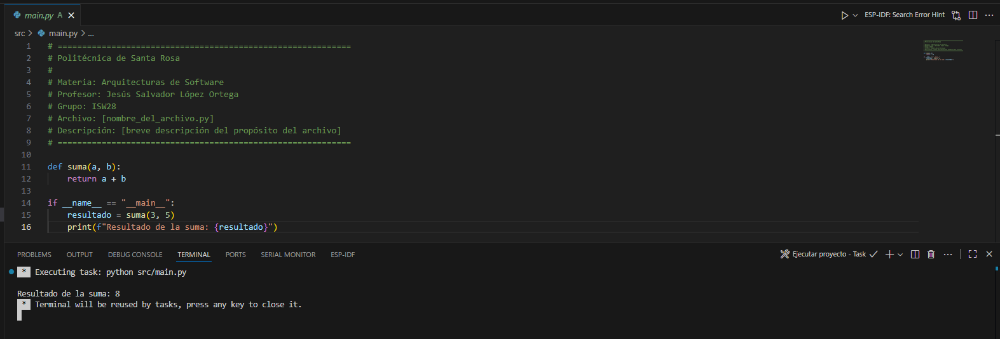
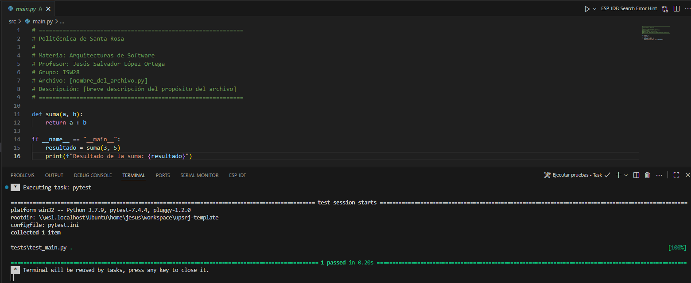

<!--
============================================================
Politécnica de Santa Rosa

Profesor: Jesús Salvador López Ortega
Archivo: README.md
Descripción: Documento principal del proyecto. Contiene instrucciones de instalación, uso, estructura y entorno reproducible.
============================================================
-->

# **Politécnica de Santa Rosa**

- **Carrera: ISW**
- **Materia: Arquitecturas de Software**
- **Instructor:** Jesús Salvador López Ortega ([LinkedIn](https://www.linkedin.com/in/jesus-salvador-lopez-ortega/) | [GitHub](https://github.com/chucholoport))

---

# **Índice**
- [**Politécnica de Santa Rosa**](#politécnica-de-santa-rosa)
- [**Índice**](#índice)
- [**Instalación y configuración de entorno de trabajo**](#instalación-y-configuración-de-entorno-de-trabajo)
  - [Pasos en la terminal de Windows (CMD)](#pasos-en-la-terminal-de-windows-cmd)
  - [Pasos en la terminal de WSL2 (Ubuntu)](#pasos-en-la-terminal-de-wsl2-ubuntu)
  - [Instalación de Docker](#instalación-de-docker)
- [**Ejecución de proyectos y pruebas**](#ejecución-de-proyectos-y-pruebas)
- [**Contacto**](#contacto)

# **Instalación y configuración de entorno de trabajo**

## Pasos en la terminal de Windows (CMD)

1. **Configurar permisos para ejecutar scripts en PowerShell**

    Si tienes una configuración restringida para correr scripts desde Windows, corre este comando en una terminal de **PowerShell (PS1)**:

    ```powershell
    Set-ExecutionPolicy RemoteSigned -Scope CurrentUser -Force
    ```

    > **Nota:** Si quieres cambiar la configuración para todos los usuarios, corre el siguiente comando en una terminal de **PowerShell (PS1) como administrador**: 

    ```powershell
    Set-ExecutionPolicy RemoteSigned -Scope LocalMachine -Force
    ```

    Puedes confirmar tu configuración con el siguiente comando:
    
    ```powershell
    Get-ExecutionPolicy
    ```

2. **Instalar Windows Subsystem for Linux (WSL)**
    ```batch
    wsl --install
    ```  

3. **Establecer WSL2 como default**
    ```batch
    wsl --set-default-version 2
    ```

🔙 [Volver al índice](#índice)

---

## Pasos en la terminal de WSL2 (Ubuntu)

1. **Configurar `python` como alias de `python3`**

   En algunas instalaciones de WSL, el comando `python` no está disponible por defecto, y solo existe `python3`.  
   Para evitar problemas de compatibilidad, instala el paquete **python-is-python3**:

   ```bash
   sudo apt update
   sudo apt install -y python-is-python3
   ```

   > **Nota:** Después de este paso, podrás ejecutar python y se usará automáticamente Python 3.

2. **Configurar `git` para usar tus credenciales**

    La distribución default de Ubuntu en WSL2 ya incluye una instalación de Git. Para confirmarlo puedes correr previamente el siguiente comando:

    ```bash
    git --version
    ```

    Necesitamos configurar tus credenciales de `git` para evitar que te pida el usuario y contraseña cada que entregas un commit. Para ello selecciona la opción que más te acomode:

   - **Configuración en GitHub con token personal**

       1. Configura tu nombre y correo:

            ```bash
            git config --global user.name "Tu Nombre"
            git config --global user.email "tu@email.com"
            ```
       2. Configura un token de autenticación
          - Ve a [https://github.com/settings/tokens](https://github.com/settings/tokens)
                  
          - Crea un nuevo token clásico
          
            

          - Selecciona todos los permisos y nombralo como `wsl-access`
          
            
          
          - Copia el token

            

          > **Nota:** El token **solo se muestra una vez**, por lo que es recomendado que lo copies y guardes en algun archivo de texto en tu computadora.

          - Usa un credential helper para no tener que pegarlo cada vez
            
            ```bash
            git config --global credential.helper store
            ```
          - Cuando hagas git push por primera vez, Git pedirá usuario y contraseña
            - **Usuario:** tu usuario de GitHub
            - **Contraseña:** pega el token generado

   - **Instalar Git Credential Manager (GCM) dentro de WSL**

       Si ya tienes instalado y configurado `git` en Windows, puedes utilizar el `credential-manager` de Windows para configurarlo en WSL:

       ```bash
       git config --global credential.helper "/mnt/c/Program\ Files/Git/mingw64/bin/git-credential-manager.exe"
       ```

       > **Nota:** El parámetro de entrada del comando debe ser el directorio de tu instalación de **Git en Windows**.

🔙 [Volver al índice](#índice)

--- 

## Instalación de Docker

1. **Descarga Docker Desktop**

    Ve a [docker.com](https://www.docker.com/products/docker-desktop/) y descarga Docker Desktop para Windows.

2. **Instala Docker Desktop**

    Durante la instalación, activa la opción `Usar el motor basado en WSL2`. Docker detectará automáticamente tu distro WSL2 (Ubuntu).

    > **Nota:** Al final de la instalación deberás reiniciar tu computadora.

3. **Configura Docker para tu distro WSL**
   
    Abre `Docker Desktop → Settings → Resources → WSL Integration`. Activa tu distro (Ubuntu) para que Docker funcione dentro de ella.

    

4. **Verifica desde WSL**
    
    Abre tu terminal WSL2 (Ubuntu) y ejecuta:
    
    ```bash
    docker --version
    docker run hello-world
    ```

    

🔙 [Volver al índice](#índice)

# **Ejecución de proyectos y pruebas**

1. Abre el proyecto en **Visual Studio Code** desde WSL2.
   
    > **Nota:** Puedes hacerlo moviendote desde la terminal de Ubuntu hasta la raíz del repositorio y ejecutando `code .`

    

2. Presiona `Ctrl + Shift + B` o `Ctrl + B` (según tu configuración).

3. Selecciona la opción `Ejecutar proyecto` o bien `Ejecutar pruebas`.
   
    

4. Verás el resultado en la terminal integrada.

    

    

🔙 [Volver al índice](#índice)

---

# **Contacto**

¿Dudas? Consulta los archivos de ayuda o pregunta a tu instructor.

**Autor:** Jesús Salvador López Ortega  
[LinkedIn](https://www.linkedin.com/in/jesus-salvador-lopez-ortega/) | [GitHub](https://github.com/chucholoport) | [Correo Institucional](mailto:jlopez@upsrj.edu.mx)

Actualizado: septiembre 2025

🔙 [Volver al índice](#índice)